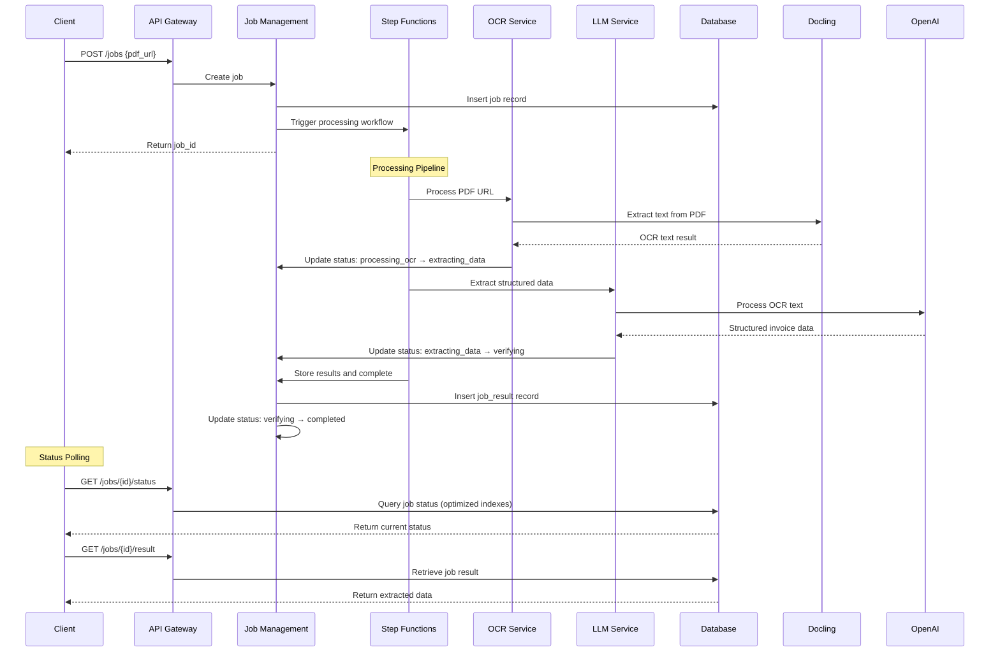

# Core Workflows

## Invoice Processing Workflow

```mermaid
sequenceDiagram
    participant Client
    participant API as API Gateway
    participant JobMgmt as Job Management
    participant SF as Step Functions
    participant OCR as OCR Service
    participant LLM as LLM Service
    participant DB as Database
    
    Client->>API: POST /jobs {pdf_url}
    API->>JobMgmt: Create job
    JobMgmt->>DB: Insert job record
    JobMgmt->>SF: Trigger processing workflow
    JobMgmt-->>Client: Return job_id
    
    Note over SF: Processing Pipeline
    SF->>OCR: Process PDF URL
    OCR->>Docling: Extract text from PDF
    Docling-->>OCR: OCR text result
    OCR->>JobMgmt: Update status: processing_ocr → extracting_data
    
    SF->>LLM: Extract structured data
    LLM->>OpenAI: Process OCR text
    OpenAI-->>LLM: Structured invoice data
    LLM->>JobMgmt: Update status: extracting_data → verifying
    
    SF->>JobMgmt: Store results and complete
    JobMgmt->>DB: Insert job_result record
    JobMgmt->>JobMgmt: Update status: verifying → completed
    
    Note over Client: Status Polling
    Client->>API: GET /jobs/{id}/status
    API->>DB: Query job status (optimized indexes)
    DB-->>Client: Return current status
    
    Client->>API: GET /jobs/{id}/result
    API->>DB: Retrieve job result
    DB-->>Client: Return extracted data
```
