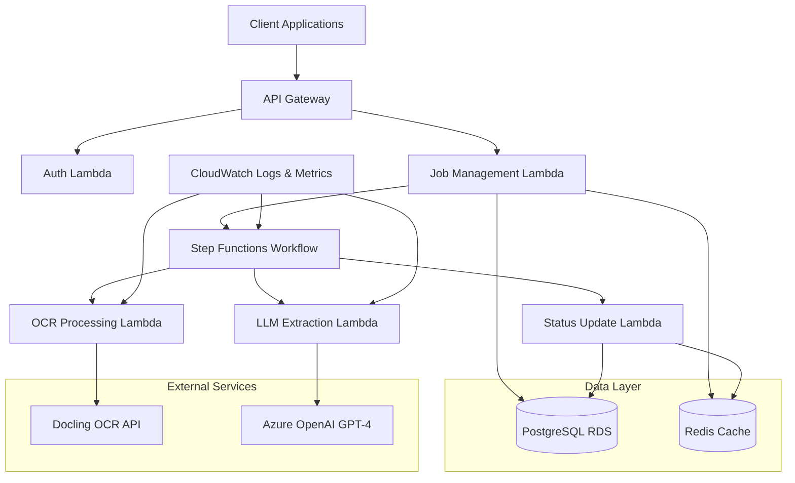

# High Level Architecture

## Technical Summary

CIRA employs a **serverless event-driven architecture** orchestrated by AWS Step Functions, combining API Gateway for request handling with Lambda functions for processing logic. The system leverages a **queue-based processing pattern** where invoice jobs flow through distinct processing stages: URL ingestion → OCR extraction → LLM data extraction → validation → results storage. **PostgreSQL provides ACID compliance** for job tracking with optimized indexing supporting sub-5-second status queries. The architecture prioritizes **cost transparency** through detailed per-job attribution and **horizontal scalability** via serverless auto-scaling, directly supporting the goal of processing 10,000+ invoices monthly with 95%+ accuracy.

## High Level Overview

**Architectural Style:** **Serverless Event-Driven Microservices** with Step Functions orchestration
- Individual Lambda functions handle specific concerns (job management, OCR processing, LLM extraction)
- AWS Step Functions manages the complex processing workflow with built-in retry and error handling
- Event-driven communication between services via Step Functions state transitions

**Repository Structure:** **Monorepo** (as specified in PRD)
- Single repository with packages: `api/`, `database/`, `shared/`, `infrastructure/`
- Unified dependency management and deployment coordination
- Simplified development workflow with shared utilities and types

**Service Architecture:** **Microservices with Centralized Orchestration**
- API Gateway handles external requests and routing
- Step Functions coordinates processing workflow across multiple Lambda functions
- Each Lambda function has a single responsibility (SRP compliance)

**Primary Data Flow:**
1. **Client Request** → API Gateway → Job Creation Lambda → Database (job record)
2. **Processing Trigger** → Step Functions → OCR Lambda → Docling API → Status Update
3. **LLM Processing** → GPT-4 Lambda → Azure OpenAI → Structured Data Extraction
4. **Results Storage** → Database → Redis Cache → Client Retrieval

**Key Architectural Decisions:**
- **Step Functions over SQS/SNS:** Provides visual workflow monitoring and complex retry logic needed for multi-stage processing
- **Lambda over ECS/EC2:** Aligns with cost optimization goals and handles variable processing loads efficiently  
- **PostgreSQL over DynamoDB:** ACID compliance for financial data and complex queries for reporting
- **Redis caching:** Reduces database load for frequent status checks, supporting 20-25 concurrent requests

## High Level Project Diagram

## Architectural and Design Patterns

**1. Serverless Event-Driven Architecture**
- **Recommendation:** Pure serverless with AWS Lambda
- **Rationale:** Aligns perfectly with PRD cost optimization goals, handles variable invoice processing loads, and provides automatic scaling for the 10,000+ invoices/month target

**2. Orchestration Pattern: Step Functions State Machine**
- **Recommendation:** AWS Step Functions with Express Workflows
- **Rationale:** Provides visual workflow monitoring, built-in retry logic, and error handling essential for the multi-stage processing pipeline (OCR → LLM → validation)

**3. Data Access Pattern: Type-Safe Query Builder with Schema Validation**
- **Recommendation:** Drizzle ORM with Zod schema validation
- **Rationale:** Type-safe queries at compile time, superior TypeScript inference, optimized for serverless cold starts, and seamless schema validation integration

**4. API Communication: REST with OpenAPI Specification**
- **Recommendation:** RESTful API with OpenAPI 3.0 documentation
- **Rationale:** Matches PRD's API-first approach, provides clear integration documentation, and supports the developer tool aesthetic requirements

**5. Error Handling: Centralized Error Management with Circuit Breaker**
- **Recommendation:** Centralized error management with circuit breaker for external APIs
- **Rationale:** Critical for managing Docling OCR and OpenAI API failures, ensures system resilience with 99.5% uptime requirement

**6. Caching Strategy: Write-Through Cache with TTL**
- **Recommendation:** Write-through caching with Redis for job status
- **Rationale:** Supports sub-5-second status query requirement while maintaining data consistency
