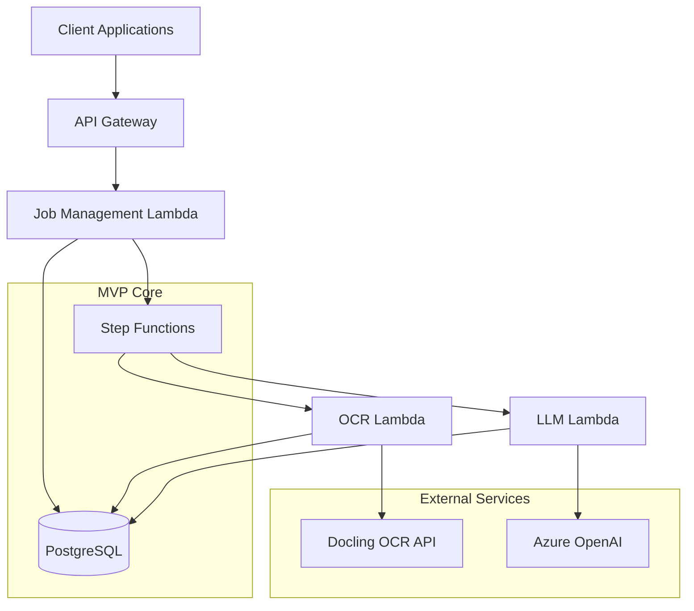
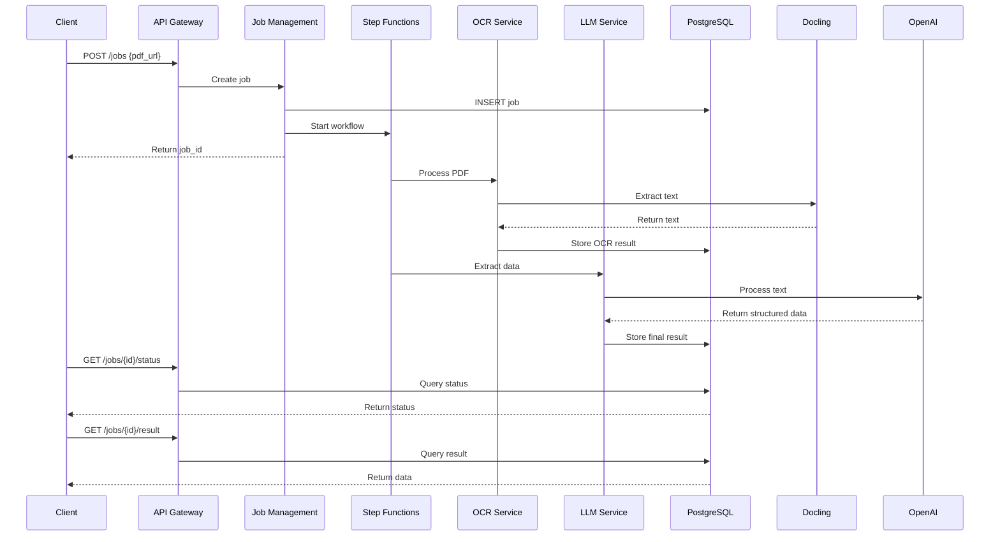

# CIRA Invoice Processing System Architecture Document (MVP)

**Version:** 2.0 (MVP-Focused)
**Date:** 2025-09-11
**Status:** Ready for MVP Development

## Introduction

This document outlines the **MVP-focused architecture** for **CIRA Invoice Processing System**, stripping away over-engineering to focus on the bare minimum needed to process invoices successfully. This architecture prioritizes getting to market quickly with a working system that can be iteratively improved based on real customer feedback.

**Key Principle:** Build the simplest thing that could possibly work, then iterate based on real usage.

### Starter Template or Existing Project

**Decision:** Custom AWS CDK setup from scratch (minimal configuration)

**Rationale:** While templates exist, a custom setup gives us maximum control over the serverless architecture while keeping dependencies minimal. We'll start with basic CDK constructs and add complexity only when proven necessary.

### Change Log

| Date | Version | Description | Author |
|------|---------|-------------|--------|
| 2025-09-11 | 2.0 | MVP-focused architecture - removed over-engineering | Winston (Architect) |

## High Level Architecture

### Technical Summary

CIRA employs a **simplified serverless architecture** using AWS Step Functions to orchestrate a basic 3-step workflow: PDF ingestion → OCR processing → LLM extraction. The system uses **PostgreSQL for all data storage** (no caching layer), with **basic error handling** and **simple cost tracking**. This minimal approach directly supports processing 10,000 invoices/month with 95% accuracy while keeping operational complexity to an absolute minimum.

### High Level Overview

**Architectural Style:** **Minimal Serverless** with Step Functions orchestration
- Three core Lambda functions: Job Management, OCR Processing, LLM Extraction
- Step Functions manages the 3-state workflow: OCR → Extract → Complete
- Single PostgreSQL database handles all data storage needs

**Repository Structure:** **Monorepo** (simplified)
- Basic structure: `api/`, `database/`, `infrastructure/` packages only
- Minimal shared utilities, focus on getting functional

**Service Architecture:** **Simple Microservices**
- API Gateway routes to Lambda functions
- Step Functions coordinates processing workflow
- Direct database access (no complex abstractions)

**Primary Data Flow:**
1. **Client Request** → API Gateway → Job Creation → Database
2. **Processing** → Step Functions → OCR → LLM → Database
3. **Results** → Database → Client

### High Level Project Diagram



### Architectural and Design Patterns

**1. Serverless-First Architecture**
- **Recommendation:** Pure AWS Lambda functions
- **Rationale:** Zero operational overhead, automatic scaling, pay-per-use aligns with MVP goals

**2. Simple State Machine Pattern**
- **Recommendation:** Basic Step Functions workflow with 3 states
- **Rationale:** Visual workflow monitoring without complex retry logic initially

**3. Direct Database Access Pattern**
- **Recommendation:** Simple database queries, no ORM initially
- **Rationale:** Fastest to implement, can optimize later when needed

**4. Basic REST API Pattern**
- **Recommendation:** 3 endpoints: POST /jobs, GET /jobs/{id}/status, GET /jobs/{id}/result
- **Rationale:** Minimal API surface area, easy to test and iterate

## Tech Stack

### Cloud Infrastructure

**Provider:** AWS
**Key Services:** API Gateway, Lambda, Step Functions, RDS PostgreSQL
**Deployment Regions:** us-east-1 (single region for MVP)

### Technology Stack Table

| Category | Technology | Version | Purpose | Rationale |
|----------|------------|---------|---------|-----------|
| **Language** | TypeScript | 5.6.2 | Primary language | Type safety + rapid development |
| **Runtime** | Node.js | 20.17.0 | JavaScript runtime | Latest LTS, reliable |
| **Framework** | Hono | 4.6.3 | Minimal API framework | Fastest serverless performance |
| **Database** | PostgreSQL | 16.4 | Single data store | ACID compliance, handles all use cases |
| **Infrastructure** | AWS CDK | 2.158.0 | Infrastructure as Code | Version-controlled infrastructure |
| **HTTP Client** | Node.js fetch | 20.17.0 | External API calls | Built-in, zero dependencies |
| **Validation** | Basic validation | Native | Input validation | Keep it simple initially |
| **Testing** | Vitest | 2.1.x | Testing framework | Fast, TypeScript-native |
| **Monitoring** | CloudWatch | Native | Basic logging | AWS-native, zero setup |
| **External OCR** | Docling API | Latest | PDF processing | PRD requirement |
| **External LLM** | Azure OpenAI | gpt-4-turbo | Data extraction | PRD requirement |

**Removed from Original Architecture:**
- ❌ Redis/ElastiCache (PostgreSQL handles caching)
- ❌ bcrypt (simple API key validation)
- ❌ Winston logging (basic console.log)
- ❌ Complex error handling libraries
- ❌ Drizzle ORM (direct SQL queries)
- ❌ Zod validation (basic input validation)

## Data Models

### Job Model

**Purpose:** Track invoice processing requests from submission to completion.

**Key Attributes:**
- `id`: string (simple UUID) - Job identifier
- `status`: enum - Current state (queued, processing, completed, failed)
- `pdf_url`: string - Source PDF URL
- `created_at`: timestamp - Creation time
- `updated_at`: timestamp - Last update
- `error_message`: string - Failure details (if any)

**Relationships:**
- Has one `JobResult` (when completed)

### JobResult Model

**Purpose:** Store extracted invoice data in simple JSON format.

**Key Attributes:**
- `job_id`: string - Reference to parent job
- `extracted_data`: JSONB - All extracted fields in flexible JSON
- `confidence_score`: decimal - Overall extraction confidence
- `tokens_used`: integer - Token consumption for cost tracking
- `created_at`: timestamp - Extraction completion time

**Relationships:**
- Belongs to one `Job`

### ApiKey Model

**Purpose:** Simple client authentication.

**Key Attributes:**
- `id`: string - Key identifier
- `key_value`: string - Actual API key (not hashed for MVP)
- `name`: string - Client-friendly name
- `is_active`: boolean - Enable/disable key
- `created_at`: timestamp - Creation time

**Relationships:**
- Referenced by `Jobs` for attribution

## Components

### API Gateway Component

**Responsibility:** Route requests and basic authentication

**Key Interfaces:**
- POST /jobs - Create new processing job
- GET /jobs/{id}/status - Get job status
- GET /jobs/{id}/result - Get extraction results

**Dependencies:** Lambda functions

**Technology Stack:** AWS API Gateway V2, basic Lambda integration

### Job Management Service

**Responsibility:** Core job lifecycle management

**Key Interfaces:**
- createJob(pdfUrl, apiKey): Job
- getJobStatus(jobId): JobStatus
- getJobResult(jobId): JobResult

**Dependencies:** PostgreSQL database

**Technology Stack:** Lambda + Hono, direct SQL queries

### Step Functions Orchestrator

**Responsibility:** Coordinate 3-step processing workflow

**Key Interfaces:**
- Start processing workflow
- Handle state transitions
- Basic error handling

**Dependencies:** OCR and LLM Lambda functions

**Technology Stack:** AWS Step Functions with simple JSON definition

### OCR Processing Service

**Responsibility:** Extract text from PDFs via Docling

**Key Interfaces:**
- processDocument(pdfUrl): OCRText
- Simple error handling

**Dependencies:** Docling API

**Technology Stack:** Lambda + Hono, native fetch

### LLM Extraction Service

**Responsibility:** Extract structured data from OCR text

**Key Interfaces:**
- extractInvoiceData(ocrText): StructuredData
- Basic token counting

**Dependencies:** Azure OpenAI API

**Technology Stack:** Lambda + Hono, native fetch

## Core Workflows

### Simplified Invoice Processing Workflow



## Database Schema

```sql
-- MVP Database Schema - Simplified
CREATE EXTENSION IF NOT EXISTS "uuid-ossp";

-- Job status enum
CREATE TYPE job_status AS ENUM ('queued', 'processing', 'completed', 'failed');

-- API Keys table (simplified)
CREATE TABLE api_keys (
    id UUID PRIMARY KEY DEFAULT uuid_generate_v4(),
    key_value VARCHAR(255) NOT NULL UNIQUE,
    name VARCHAR(100) NOT NULL,
    is_active BOOLEAN DEFAULT true,
    created_at TIMESTAMP DEFAULT CURRENT_TIMESTAMP
);

-- Jobs table (simplified)
CREATE TABLE jobs (
    id UUID PRIMARY KEY DEFAULT uuid_generate_v4(),
    api_key_id UUID REFERENCES api_keys(id),
    status job_status DEFAULT 'queued',
    pdf_url TEXT NOT NULL,
    created_at TIMESTAMP DEFAULT CURRENT_TIMESTAMP,
    updated_at TIMESTAMP DEFAULT CURRENT_TIMESTAMP,
    error_message TEXT
);

-- Job results table (simplified)
CREATE TABLE job_results (
    id UUID PRIMARY KEY DEFAULT uuid_generate_v4(),
    job_id UUID UNIQUE REFERENCES jobs(id),
    extracted_data JSONB, -- Flexible JSON storage
    confidence_score DECIMAL(3,2),
    tokens_used INTEGER DEFAULT 0,
    created_at TIMESTAMP DEFAULT CURRENT_TIMESTAMP
);

-- Basic indexes only
CREATE INDEX idx_jobs_status ON jobs(status);
CREATE INDEX idx_jobs_created_at ON jobs(created_at);
CREATE INDEX idx_job_results_job_id ON job_results(job_id);

-- Auto-update trigger
CREATE OR REPLACE FUNCTION update_updated_at()
RETURNS TRIGGER AS $$
BEGIN
    NEW.updated_at = CURRENT_TIMESTAMP;
    RETURN NEW;
END;
$$ language 'plpgsql';

CREATE TRIGGER update_jobs_updated_at
    BEFORE UPDATE ON jobs
    FOR EACH ROW
    EXECUTE FUNCTION update_updated_at();

-- Sample data for development
INSERT INTO api_keys (key_value, name) VALUES
('dev-key-12345', 'Development Key');
```

## Source Tree

```
cira-invoice-aws/
├── packages/
│   ├── api/                    # API Lambda functions
│   │   ├── src/
│   │   │   ├── handlers/       # Lambda handlers
│   │   │   │   ├── jobs.ts     # Job management
│   │   │   │   ├── status.ts   # Status checking
│   │   │   │   └── results.ts  # Result retrieval
│   │   │   ├── services/       # Business logic
│   │   │   │   ├── job-service.ts
│   │   │   │   ├── ocr-service.ts
│   │   │   │   └── llm-service.ts
│   │   │   └── utils/          # Simple utilities
│   │   │       ├── db.ts       # Database connection
│   │   │       └── config.ts   # Configuration
│   │   └── package.json
│   ├── database/               # Database setup
│   │   ├── schema.sql          # Database schema
│   │   └── seed.sql            # Sample data
│   └── infrastructure/         # AWS CDK
│       ├── src/
│       │   ├── api-stack.ts    # API Gateway + Lambda
│       │   ├── db-stack.ts     # RDS PostgreSQL
│       │   └── workflow-stack.ts # Step Functions
│       └── package.json
├── scripts/
│   ├── deploy.sh               # Simple deployment
│   └── setup-db.sh             # Database setup
├── package.json                # Root dependencies
└── README.md                   # Getting started guide
```

## Infrastructure and Deployment

### Infrastructure as Code
- **Tool:** AWS CDK 2.158.0 with minimal constructs
- **Location:** `packages/infrastructure/`
- **Approach:** Single-stack deployment for MVP

### Deployment Strategy
- **Strategy:** Simple push-to-deploy via CDK
- **CI/CD Platform:** GitHub Actions (basic workflow)
- **Pipeline Configuration:** `.github/workflows/deploy.yml`

### Environments
- **Development:** Local development with LocalStack
- **Production:** Single AWS environment

### Rollback Strategy
- **Primary Method:** CDK rollback command
- **Trigger Conditions:** Manual only for MVP
- **Recovery Time Objective:** <30 minutes manual intervention

## Error Handling Strategy

### General Approach
- **Error Model:** Simple try/catch with basic error objects
- **Exception Hierarchy:** Native Error objects with custom messages
- **Error Propagation:** Basic error bubbling to API layer

### Logging Standards
- **Library:** console.log with JSON formatting
- **Format:** `{"level": "error", "message": "...", "jobId": "...", "timestamp": "..."}`
- **Levels:** ERROR, INFO only for MVP

### External API Error Handling
- **Retry Policy:** Step Functions default retry (3 attempts)
- **Timeout Configuration:** 5 minutes OCR, 30 seconds LLM
- **Error Translation:** Basic error message passthrough

## Coding Standards

### Core Standards
- **Languages & Runtimes:** Node.js 20.17.0, TypeScript 5.6.2
- **Style & Linting:** Basic ESLint, minimal Prettier
- **Test Organization:** Co-located `.test.ts` files

### Critical Rules
- **Use structured console logging:** `console.log(JSON.stringify({level, message, context}))`
- **All database queries must handle errors:** Basic try/catch around all DB operations
- **External API calls must have timeouts:** Use fetch with AbortController
- **Never expose internal errors to clients:** Always return generic error messages

## Test Strategy and Standards

### Testing Philosophy
- **Approach:** Test the critical path, skip edge cases initially
- **Coverage Goals:** 70% for core services
- **Test Pyramid:** Mostly integration tests, minimal unit tests

### Unit Tests
- **Framework:** Vitest 2.1.x
- **File Convention:** `*.test.ts`
- **Coverage Requirement:** Core business logic only

**AI Agent Requirements:**
- Focus on happy path testing
- Mock external services (Docling, OpenAI)
- Test database operations with real database

### Integration Tests
- **Scope:** End-to-end API testing
- **Test Infrastructure:** Docker PostgreSQL for tests
- **Coverage:** All API endpoints with valid inputs

## Security

### Input Validation
- **Validation Location:** API Gateway + Lambda function entry points
- **Required Rules:**
  - PDF URL format validation (HTTPS required)
  - API key presence validation
  - Basic XSS prevention

### Authentication & Authorization
- **Auth Method:** Simple API key in header (`X-API-Key`)
- **Required Patterns:**
  - Validate API key exists and is active
  - Log all authentication attempts

### Secrets Management
- **Development:** Environment variables
- **Production:** AWS Systems Manager Parameter Store
- **Code Requirements:**
  - No hardcoded secrets
  - Access via process.env only

### Data Protection
- **Encryption at Rest:** RDS default encryption
- **Encryption in Transit:** HTTPS only
- **Logging Restrictions:** Never log PDF content or API keys

## MVP Implementation Phases

### Phase 1: Core Foundation (Week 1-2)
**Goal:** Basic API that accepts jobs and stores them

**Deliverables:**
- ✅ API Gateway with 3 endpoints
- ✅ PostgreSQL database with 3 tables
- ✅ Basic Lambda functions (no processing yet)
- ✅ Simple authentication

**Success Criteria:**
- Can create jobs via API
- Can check job status
- Database stores job records

### Phase 2: Processing Pipeline (Week 3-4)
**Goal:** Complete invoice processing workflow

**Deliverables:**
- ✅ Step Functions workflow (3 states)
- ✅ Docling OCR integration
- ✅ OpenAI extraction integration
- ✅ Basic error handling

**Success Criteria:**
- End-to-end invoice processing
- Structured data extraction
- 80% success rate on standard invoices

### Phase 3: Production Readiness (Week 5-6)
**Goal:** Deploy and monitor in production

**Deliverables:**
- ✅ CDK deployment automation
- ✅ Basic monitoring and alerts
- ✅ Simple documentation
- ✅ Initial customer testing

**Success Criteria:**
- Deployed to AWS
- Processing real customer invoices
- Basic operational monitoring

## Next Steps

### Architect Prompt
This MVP architecture is ready for immediate development. Key handoff requirements:

1. **Start with Phase 1** - Build the API foundation first
2. **Use this simplified schema** - No complex migrations needed
3. **Focus on the happy path** - Error handling can be basic initially
4. **Test with real PDFs early** - Validate Docling/OpenAI integration quickly
5. **Deploy frequently** - Use CDK for infrastructure automation

The architecture supports all PRD requirements while eliminating over-engineering. Build this first, learn from real usage, then iterate based on customer feedback.

**Critical Success Factors:**
- Keep database schema simple
- Use Step Functions for reliability
- Focus on API contract consistency
- Monitor token usage for cost control

This MVP can be built in 4-6 weeks and will provide immediate value to customers while establishing a foundation for future enhancements.
