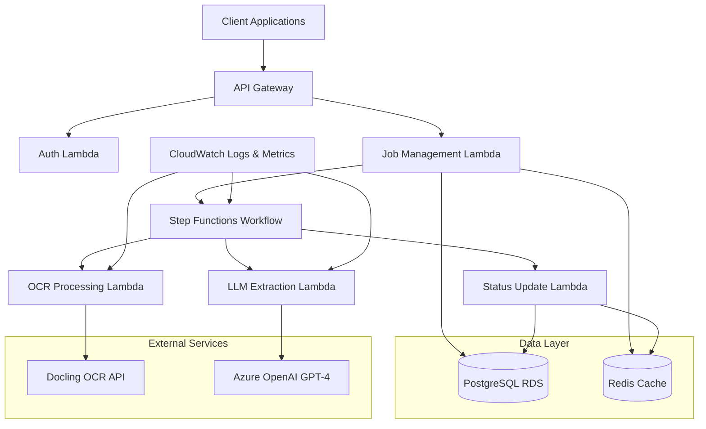
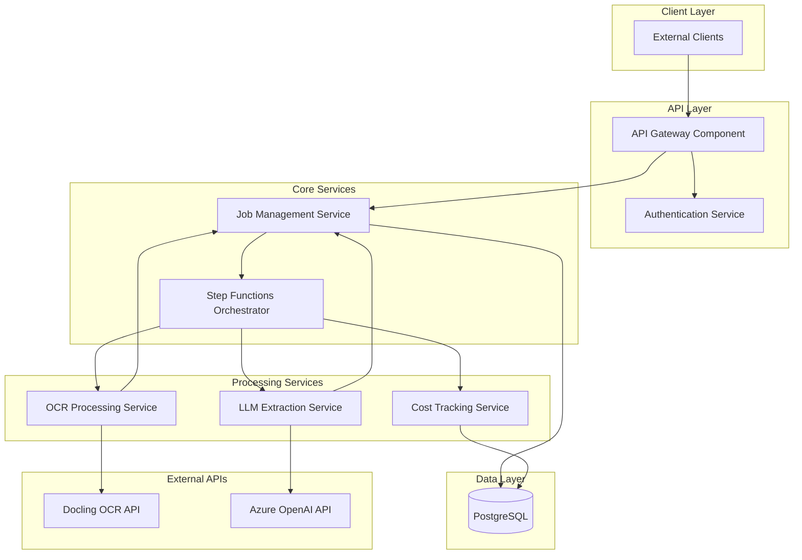
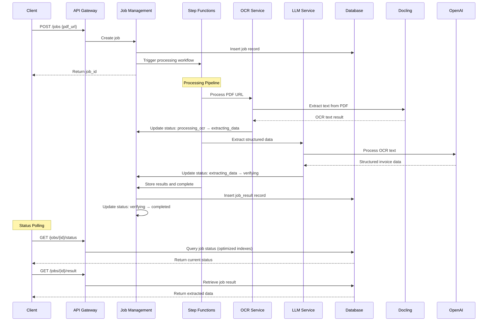

# CIRA Invoice Processing System Architecture Document

**Version:** 1.0  
**Date:** 2025-09-10  
**Status:** Ready for Development

## Introduction

This document outlines the overall project architecture for **CIRA Invoice Processing System**, including backend systems, shared services, and non-UI specific concerns. Its primary goal is to serve as the guiding architectural blueprint for AI-driven development, ensuring consistency and adherence to chosen patterns and technologies.

**Relationship to Frontend Architecture:**
The system is primarily API-first with a minimal dashboard planned for Phase 2. A separate Frontend Architecture Document may be created if the UI components expand beyond basic monitoring and management interfaces. Core technology stack choices documented herein are definitive for the entire project, including any frontend components.

### Starter Template or Existing Project

**Decision:** Custom AWS CDK setup from scratch

**Rationale:** Given the specific requirements for Step Functions orchestration, monorepo structure, and infrastructure as code, a custom AWS CDK setup provides the most alignment with the architectural vision while avoiding template constraints. This approach offers maximum control over the serverless architecture design and scaling patterns needed for the invoice processing workflow.

### Change Log

| Date | Version | Description | Author |
|------|---------|-------------|--------|
| 2025-09-10 | 1.0 | Initial architecture document creation | Winston (Architect) |
| 2025-09-10 | 1.1 | Updated to use Drizzle ORM 0.44.x and Zod 4.1.x for improved type safety and serverless performance | Winston (Architect) |
| 2025-09-10 | 1.2 | Simplified stack: Removed Redis, replaced Axios/Winston with native Node.js, upgraded to Vitest, simplified error handling | Winston (Architect) |
| 2025-09-10 | 1.3 | Updated JobResult schema to match InvoiceSchema with 21 specific fields, removed LineItem table for simplified data model | Winston (Architect) |

## High Level Architecture

### Technical Summary

CIRA employs a **serverless event-driven architecture** orchestrated by AWS Step Functions, combining API Gateway for request handling with Lambda functions for processing logic. The system leverages a **queue-based processing pattern** where invoice jobs flow through distinct processing stages: URL ingestion → OCR extraction → LLM data extraction → validation → results storage. **PostgreSQL provides ACID compliance** for job tracking with optimized indexing supporting sub-5-second status queries. The architecture prioritizes **cost transparency** through detailed per-job attribution and **horizontal scalability** via serverless auto-scaling, directly supporting the goal of processing 10,000+ invoices monthly with 95%+ accuracy.

### High Level Overview

**Architectural Style:** **Serverless Event-Driven Microservices** with Step Functions orchestration
- Individual Lambda functions handle specific concerns (job management, OCR processing, LLM extraction)
- AWS Step Functions manages the complex processing workflow with built-in retry and error handling
- Event-driven communication between services via Step Functions state transitions

**Repository Structure:** **Monorepo** (as specified in PRD)
- Single repository with packages: `api/`, `database/`, `shared/`, `infrastructure/`
- Unified dependency management and deployment coordination
- Simplified development workflow with shared utilities and types

**Service Architecture:** **Microservices with Centralized Orchestration**
- API Gateway handles external requests and routing
- Step Functions coordinates processing workflow across multiple Lambda functions
- Each Lambda function has a single responsibility (SRP compliance)

**Primary Data Flow:**
1. **Client Request** → API Gateway → Job Creation Lambda → Database (job record)
2. **Processing Trigger** → Step Functions → OCR Lambda → Docling API → Status Update
3. **LLM Processing** → GPT-4 Lambda → Azure OpenAI → Structured Data Extraction
4. **Results Storage** → Database → Redis Cache → Client Retrieval

**Key Architectural Decisions:**
- **Step Functions over SQS/SNS:** Provides visual workflow monitoring and complex retry logic needed for multi-stage processing
- **Lambda over ECS/EC2:** Aligns with cost optimization goals and handles variable processing loads efficiently  
- **PostgreSQL over DynamoDB:** ACID compliance for financial data and complex queries for reporting
- **Redis caching:** Reduces database load for frequent status checks, supporting 20-25 concurrent requests

### High Level Project Diagram



### Architectural and Design Patterns

**1. Serverless Event-Driven Architecture**
- **Recommendation:** Pure serverless with AWS Lambda
- **Rationale:** Aligns perfectly with PRD cost optimization goals, handles variable invoice processing loads, and provides automatic scaling for the 10,000+ invoices/month target

**2. Orchestration Pattern: Step Functions State Machine**
- **Recommendation:** AWS Step Functions with Express Workflows
- **Rationale:** Provides visual workflow monitoring, built-in retry logic, and error handling essential for the multi-stage processing pipeline (OCR → LLM → validation)

**3. Data Access Pattern: Type-Safe Query Builder with Schema Validation**
- **Recommendation:** Drizzle ORM with Zod schema validation
- **Rationale:** Type-safe queries at compile time, superior TypeScript inference, optimized for serverless cold starts, and seamless schema validation integration

**4. API Communication: REST with OpenAPI Specification**
- **Recommendation:** RESTful API with OpenAPI 3.0 documentation
- **Rationale:** Matches PRD's API-first approach, provides clear integration documentation, and supports the developer tool aesthetic requirements

**5. Error Handling: Centralized Error Management with Circuit Breaker**
- **Recommendation:** Centralized error management with circuit breaker for external APIs
- **Rationale:** Critical for managing Docling OCR and OpenAI API failures, ensures system resilience with 99.5% uptime requirement

**6. Caching Strategy: Write-Through Cache with TTL**
- **Recommendation:** Write-through caching with Redis for job status
- **Rationale:** Supports sub-5-second status query requirement while maintaining data consistency

## Tech Stack

### Cloud Infrastructure

**Provider:** AWS  
**Key Services:** API Gateway, Lambda, Step Functions, RDS PostgreSQL, CloudWatch  
**Deployment Regions:** us-east-1 (primary)

### Technology Stack Table

| Category | Technology | Version | Purpose | Rationale |
|----------|------------|---------|---------|-----------|
| **Language** | TypeScript | 5.6.2 | Primary development language | Strong typing, excellent tooling, latest stable release |
| **Runtime** | Node.js | 20.17.0 | JavaScript runtime | Latest LTS version, stable performance, security updates |
| **Framework** | Hono | 4.6.3 | API framework for Lambda | Serverless-optimized, 3x faster cold starts, TypeScript native |
| **Database** | PostgreSQL | 16.4 | Primary data store | ACID compliance for financial data, latest stable with performance improvements |
| **Infrastructure** | AWS CDK | 2.158.0 | Infrastructure as Code | Version-controlled infrastructure, latest stable with new constructs |
| **ORM** | Drizzle ORM | 0.44.x | Database abstraction | Type-safe SQL queries, serverless-optimized, superior TypeScript inference |
| **Migration Tool** | Drizzle Kit | 0.44.x | Schema migrations | Type-safe migrations with automatic SQL generation |
| **Validation** | Zod | 4.1.x | Schema validation | TypeScript-first validation, runtime type checking, Drizzle integration |
| **HTTP Client** | Node.js fetch | 20.17.0 | External API calls | Native HTTP client, built-in timeout support, zero dependencies |
| **Logging** | console + CloudWatch | Native | Structured logging | JSON logging with CloudWatch integration, correlation IDs |
| **Hashing** | bcrypt | 5.1.1 | API key hashing | Secure password hashing, configurable cost factor |
| **ID Generation** | crypto.randomUUID | 20.17.0 | Job ID generation | Native UUID generation, cryptographically secure |
| **Testing** | Vitest | 2.1.x | Testing framework | Fast execution, superior TypeScript support, modern testing experience |
| **Linting** | ESLint | 9.10.0 | Code quality | Code consistency, error prevention, TypeScript rules |
| **Formatting** | Prettier | 3.3.3 | Code formatting | Automated formatting, team consistency |
| **CI/CD** | GitHub Actions | N/A | Deployment automation | PRD requirement, AWS integration, OIDC support |
| **Monitoring** | CloudWatch | N/A | Logging & metrics | Native AWS integration, cost tracking, alarms |
| **External OCR** | Docling API | Latest | PDF text extraction | PRD requirement, 5-minute timeout |
| **External LLM** | Azure OpenAI GPT-4 | gpt-4-turbo | Data extraction | Latest model, structured output mode, cost optimization |

## Data Models

### Job Model

**Purpose:** Represents a single invoice processing request from submission through completion, serving as the central entity that tracks the entire processing lifecycle.

**Key Attributes:**
- `id`: string (NanoID) - Unique job identifier for URL-safe references
- `status`: enum - Current processing state (queued, processing_ocr, extracting_data, verifying, completed, failed)
- `pdf_url`: string - Source URL of the PDF invoice to be processed
- `created_at`: timestamp - Job submission time for audit trail
- `updated_at`: timestamp - Last status change for monitoring
- `completed_at`: timestamp - Processing completion time for SLA tracking
- `processing_cost`: decimal - Total cost attribution for billing transparency
- `retry_count`: integer - Number of retry attempts for reliability tracking
- `error_message`: string - Failure reason for debugging and user feedback

**Relationships:**
- Has one `JobResult` (extracted invoice data)
- Has many `ProcessingEvents` (audit trail)
- Belongs to one `ApiKey` (client attribution)

### JobResult Model

**Purpose:** Stores the structured invoice data extracted by the LLM processing based on the fixed InvoiceSchema, including confidence scores and validation metadata.

**Key Attributes:**
- `job_id`: string - Foreign key to parent Job
- `invoice_date`: date - Invoice issue date (nullable)
- `invoice_number`: string - Unique invoice identifier (nullable)
- `invoice_due_date`: date - Payment due date (nullable)
- `invoice_past_due_amount`: decimal - Outstanding amount from previous cycles (nullable)
- `invoice_current_due_amount`: decimal - Current billing cycle amount due (nullable)
- `invoice_late_fee_amount`: decimal - Late payment fees (nullable)
- `credit_amount`: decimal - Credits applied to invoice (nullable)
- `policy_number`: string - Insurance policy number (nullable)
- `account_number`: string - Customer account/property ID (nullable)
- `policy_start_date`: date - Policy period start (nullable)
- `policy_end_date`: date - Policy period end (nullable)
- `service_start_date`: date - Service period start (nullable)
- `service_end_date`: date - Service period end (nullable)
- `payment_remittance_address`: text - Payment address (nullable)
- `payment_remittance_entity`: string - Payment entity name (nullable)
- `payment_remittance_entity_care_of`: string - Care of information (nullable)
- `reasoning`: text - LLM processing reasoning (nullable)
- `community_name`: string - Community/property name (nullable)
- `vendor_name`: string - Service provider name (nullable)
- `valid_input`: boolean - Input clarity and processability flag (nullable)
- `confidence_score`: decimal - Overall extraction confidence (0.0-1.0)
- `raw_ocr_text`: text - Original OCR output for validation
- `llm_tokens_used`: integer - Token consumption for cost tracking
- `additional_data`: JSONB - Future extensibility for custom fields

**Relationships:**
- Belongs to one `Job`


### ApiKey Model

**Purpose:** Manages client authentication and usage tracking for billing and access control.

**Key Attributes:**
- `id`: string - Internal key identifier
- `key_hash`: string - Hashed API key for secure storage
- `name`: string - Client-friendly key name
- `created_at`: timestamp - Key creation time
- `last_used_at`: timestamp - Recent usage tracking
- `is_active`: boolean - Key enablement status
- `usage_count`: integer - Total requests made
- `monthly_usage`: integer - Current month request count
- `rate_limit`: integer - Requests per minute limit

**Relationships:**
- Has many `Jobs` (usage attribution)
- Has many `UsageEvents` (detailed tracking)

### ProcessingEvent Model

**Purpose:** Provides comprehensive audit trail for job processing steps, costs, and system interactions.

**Key Attributes:**
- `job_id`: string - Foreign key to Job
- `event_type`: enum - Type of processing event (status_change, external_api_call, error_occurred)
- `timestamp`: timestamp - Event occurrence time
- `details`: JSON - Event-specific metadata and context
- `cost_incurred`: decimal - Cost associated with this processing step
- `external_service`: string - Which external API was called (docling, openai)
- `duration_ms`: integer - Processing time for performance tracking

**Relationships:**
- Belongs to one `Job`

## Components

### API Gateway Component

**Responsibility:** Request routing, authentication, rate limiting, and CORS handling for all external client interactions.

**Key Interfaces:**
- POST /jobs - Accept new invoice processing requests
- GET /jobs/{id}/status - Retrieve current job processing status
- GET /jobs/{id}/result - Fetch completed extraction results
- GET /jobs/{id}/cost - Provide detailed cost breakdown

**Dependencies:** Authentication Service, Job Management Service

**Technology Stack:** AWS API Gateway V2, Lambda authorizer functions, CloudWatch logging

### Job Management Service

**Responsibility:** Core job lifecycle management including creation, status tracking, and result storage with database transaction management.

**Key Interfaces:**
- createJob(pdfUrl: string, apiKey: string): Promise<Job>
- updateJobStatus(jobId: string, status: JobStatus): Promise<void>
- getJobStatus(jobId: string): Promise<JobStatus>
- getJobResult(jobId: string): Promise<JobResult>

**Dependencies:** Database (PostgreSQL), Step Functions orchestrator

**Technology Stack:** Lambda functions with Hono framework, Drizzle ORM for type-safe data access, optimized connection pooling

### Step Functions Orchestrator

**Responsibility:** Workflow orchestration managing the complete processing pipeline with error handling, retries, and state transitions.

**Key Interfaces:**
- startProcessingWorkflow(job: Job): Promise<ExecutionId>
- handleProcessingStep(state: ProcessingState): Promise<NextState>
- handleProcessingError(error: ProcessingError): Promise<RetryAction>

**Dependencies:** OCR Processing Service, LLM Extraction Service, Job Management Service

**Technology Stack:** AWS Step Functions Express Workflows, CloudWatch monitoring, JSON state definitions

### OCR Processing Service

**Responsibility:** PDF document processing through Docling API integration with timeout handling, retry logic, and quality validation.

**Key Interfaces:**
- processDocument(pdfUrl: string): Promise<OCRResult>
- validatePDFUrl(url: string): Promise<ValidationResult>
- handleOCRTimeout(): Promise<RetryStrategy>

**Dependencies:** Docling OCR API, Job Management Service (status updates)

**Technology Stack:** Lambda functions with Hono framework, native fetch HTTP client, Step Functions retry handling, native logging

### LLM Extraction Service

**Responsibility:** Intelligent data extraction from OCR text using Azure OpenAI GPT-4 with structured output parsing and cost tracking.

**Key Interfaces:**
- extractInvoiceData(ocrText: string, schema: InvoiceSchema): Promise<ExtractionResult>
- validateExtractedData(data: InvoiceData): Promise<ValidationResult>
- trackProcessingCosts(tokens: TokenUsage): Promise<CostAttribution>

**Dependencies:** Azure OpenAI API, Job Management Service, Cost Tracking Service

**Technology Stack:** Lambda functions with Hono framework, native fetch with OpenAI API, structured prompt templates, token counting

### Authentication Service

**Responsibility:** API key management, validation, and usage tracking with rate limiting enforcement.

**Key Interfaces:**
- validateApiKey(keyHash: string): Promise<ApiKeyValidation>
- trackUsage(apiKeyId: string): Promise<UsageUpdate>
- enforceRateLimit(apiKeyId: string): Promise<RateLimitResult>

**Dependencies:** Database (ApiKey model), API Gateway throttling

**Technology Stack:** Lambda authorizer, bcrypt for hashing, API Gateway throttling

### Cost Tracking Service

**Responsibility:** Comprehensive cost attribution for all processing operations with real-time tracking and reporting.

**Key Interfaces:**
- recordProcessingCost(jobId: string, cost: ProcessingCost): Promise<void>
- calculateJobCost(jobId: string): Promise<TotalCost>
- generateCostReport(timeframe: TimeRange): Promise<CostReport>

**Dependencies:** Database (ProcessingEvent model), External service pricing APIs

**Technology Stack:** Lambda functions with Hono framework, scheduled cost calculations, native fetch for pricing APIs

### Component Diagrams



## Core Workflows

### Invoice Processing Workflow



## REST API Spec

```yaml
openapi: 3.0.0
info:
  title: CIRA Invoice Processing API
  version: 1.0.0
  description: |
    CIRA provides AI-powered invoice processing with dual-LLM validation for 95%+ accuracy.
    Submit PDF URLs for processing and receive structured invoice data with cost transparency.
  contact:
    name: CIRA API Support
    url: https://docs.cira-invoice.com
servers:
  - url: https://api.cira-invoice.com/v1
    description: Production API server
  - url: https://staging-api.cira-invoice.com/v1
    description: Staging environment

security:
  - ApiKeyAuth: []

paths:
  /health:
    get:
      summary: Health check endpoint
      description: System health and status verification
      tags:
        - System
      security: []
      responses:
        '200':
          description: System is healthy
          content:
            application/json:
              schema:
                type: object
                properties:
                  status:
                    type: string
                    example: "healthy"
                  timestamp:
                    type: string
                    format: date-time
                  version:
                    type: string
                    example: "1.0.0"

  /jobs:
    post:
      summary: Submit invoice processing job
      description: |
        Submit a PDF invoice URL for processing. Returns immediately with job ID for status tracking.
        Processing typically completes within 2 minutes.
      tags:
        - Jobs
      requestBody:
        required: true
        content:
          application/json:
            schema:
              type: object
              required:
                - pdf_url
              properties:
                pdf_url:
                  type: string
                  format: uri
                  description: HTTPS URL to PDF invoice document
                  example: "https://example.com/invoices/INV-2024-001.pdf"
              example:
                pdf_url: "https://example.com/invoices/INV-2024-001.pdf"
      responses:
        '201':
          description: Job created successfully
          content:
            application/json:
              schema:
                type: object
                properties:
                  job_id:
                    type: string
                    description: Unique job identifier (NanoID format)
                    example: "V1StGXR8_Z5jdHi6B-myT"
                  status:
                    type: string
                    enum: ["queued"]
                    example: "queued"
                  created_at:
                    type: string
                    format: date-time
                    example: "2024-01-15T10:30:00Z"
        '400':
          $ref: '#/components/responses/BadRequest'
        '401':
          $ref: '#/components/responses/Unauthorized'
        '429':
          $ref: '#/components/responses/RateLimited'

  /jobs/{job_id}/status:
    get:
      summary: Get job processing status
      description: |
        Retrieve current processing status and progress information.
        Status updates in real-time as job progresses through processing pipeline.
      tags:
        - Jobs
      parameters:
        - name: job_id
          in: path
          required: true
          schema:
            type: string
          description: Unique job identifier
          example: "V1StGXR8_Z5jdHi6B-myT"
      responses:
        '200':
          description: Job status retrieved successfully
          content:
            application/json:
              schema:
                type: object
                properties:
                  job_id:
                    type: string
                    example: "V1StGXR8_Z5jdHi6B-myT"
                  status:
                    type: string
                    enum: ["queued", "processing_ocr", "extracting_data", "verifying", "completed", "failed"]
                    example: "extracting_data"
                  created_at:
                    type: string
                    format: date-time
                    example: "2024-01-15T10:30:00Z"
                  updated_at:
                    type: string
                    format: date-time
                    example: "2024-01-15T10:31:45Z"
                  estimated_completion:
                    type: string
                    format: date-time
                    description: Estimated completion time (present during processing)
                    example: "2024-01-15T10:32:30Z"
                  processing_duration_ms:
                    type: integer
                    description: Current processing time in milliseconds
                    example: 105000
        '404':
          $ref: '#/components/responses/NotFound'
        '401':
          $ref: '#/components/responses/Unauthorized'

  /jobs/{job_id}/result:
    get:
      summary: Get extracted invoice data
      description: |
        Retrieve structured invoice data after successful processing.
        Only available when job status is 'completed'.
      tags:
        - Jobs
      parameters:
        - name: job_id
          in: path
          required: true
          schema:
            type: string
          description: Unique job identifier
          example: "V1StGXR8_Z5jdHi6B-myT"
      responses:
        '200':
          description: Invoice data extracted successfully
          content:
            application/json:
              schema:
                type: object
                properties:
                  job_id:
                    type: string
                    example: "V1StGXR8_Z5jdHi6B-myT"
                  status:
                    type: string
                    enum: ["completed"]
                  extracted_data:
                    $ref: '#/components/schemas/InvoiceData'
                  confidence_score:
                    type: number
                    format: float
                    minimum: 0.0
                    maximum: 1.0
                    description: Overall extraction confidence
                    example: 0.95
                  processing_duration_ms:
                    type: integer
                    example: 87500
                  completed_at:
                    type: string
                    format: date-time
                    example: "2024-01-15T10:31:27Z"
        '404':
          $ref: '#/components/responses/NotFound'
        '409':
          description: Job not yet completed
          content:
            application/json:
              schema:
                $ref: '#/components/schemas/Error'
              example:
                error_code: "JOB_NOT_COMPLETED"
                message: "Job is still processing. Current status: extracting_data"
                suggested_action: "Poll /jobs/{job_id}/status until status is 'completed'"

  /jobs/{job_id}/cost:
    get:
      summary: Get job processing cost breakdown
      description: |
        Detailed cost attribution for processing operations including all external service charges.
        Available for jobs in any status for cost transparency.
      tags:
        - Jobs
      parameters:
        - name: job_id
          in: path
          required: true
          schema:
            type: string
          description: Unique job identifier
          example: "V1StGXR8_Z5jdHi6B-myT"
      responses:
        '200':
          description: Cost breakdown retrieved successfully
          content:
            application/json:
              schema:
                type: object
                properties:
                  job_id:
                    type: string
                    example: "V1StGXR8_Z5jdHi6B-myT"
                  total_cost:
                    type: number
                    format: decimal
                    description: Total processing cost in USD
                    example: 0.42
                  cost_breakdown:
                    type: object
                    properties:
                      ocr_processing:
                        type: number
                        format: decimal
                        example: 0.15
                      llm_extraction:
                        type: number
                        format: decimal
                        example: 0.23
                      infrastructure:
                        type: number
                        format: decimal
                        example: 0.04
                  external_service_costs:
                    type: object
                    properties:
                      docling_api:
                        type: number
                        format: decimal
                        example: 0.15
                      azure_openai:
                        type: object
                        properties:
                          input_tokens:
                            type: integer
                            example: 1250
                          output_tokens:
                            type: integer
                            example: 890
                          total_cost:
                            type: number
                            format: decimal
                            example: 0.23
        '404':
          $ref: '#/components/responses/NotFound'

components:
  securitySchemes:
    ApiKeyAuth:
      type: apiKey
      in: header
      name: X-API-Key
      description: API key for authentication and usage tracking

  schemas:
    InvoiceData:
      type: object
      description: Structured invoice data extracted from PDF based on InvoiceSchema
      properties:
        invoice_date:
          type: string
          nullable: true
          description: The date the invoice was issued
          example: "2024-01-10"
        invoice_number:
          type: string
          nullable: true
          description: Invoice number is the unique number that identifies the invoice
          example: "INV-2024-001"
        invoice_due_date:
          type: string
          nullable: true
          description: The date by which the invoice should be paid
          example: "2024-02-10"
        invoice_past_due_amount:
          type: number
          nullable: true
          description: The outstanding amount from previous billing cycles
          example: 150.00
        invoice_current_due_amount:
          type: number
          nullable: true
          description: The amount due for the current billing cycle
          example: 1250.00
        invoice_late_fee_amount:
          type: number
          nullable: true
          description: Any fees applied for late payment
          example: 25.00
        credit_amount:
          type: number
          nullable: true
          description: Any credits applied to the invoice
          example: 50.00
        policy_number:
          type: string
          nullable: true
          description: The insurance policy number associated with the invoice
          example: "POL-2024-12345"
        account_number:
          type: string
          nullable: true
          description: The customer's account number
          example: "ACC-789456"
        policy_start_date:
          type: string
          nullable: true
          description: The start date of the policy period
          example: "2024-01-01"
        policy_end_date:
          type: string
          nullable: true
          description: The end date of the policy period
          example: "2024-12-31"
        service_start_date:
          type: string
          nullable: true
          description: The start date of the service period covered by the invoice
          example: "2024-01-01"
        service_end_date:
          type: string
          nullable: true
          description: The end date of the service period covered by the invoice
          example: "2024-01-31"
        payment_remittance_address:
          type: string
          nullable: true
          description: The address where the payment should be sent
          example: "PO Box 12345, Payment Processing, NY 10001"
        payment_remittance_entity:
          type: string
          nullable: true
          description: The entity to whom the payment should be made out
          example: "Acme Insurance Services"
        payment_remittance_entity_care_of:
          type: string
          nullable: true
          description: Any 'care of' information for the payment remittance entity
          example: "c/o Payment Department"
        reasoning:
          type: string
          nullable: true
          description: Explanation or reasoning for any decisions made during processing
          example: "Invoice clearly shows policy number and current due amount"
        community_name:
          type: string
          nullable: true
          description: The name of the community or property being serviced
          example: "Sunset Ridge Community"
        vendor_name:
          type: string
          nullable: true
          description: The name of the vendor providing the service
          example: "Acme Insurance Services"
        valid_input:
          type: boolean
          nullable: true
          description: Whether the input is clear, readable and processable
          example: true


    Error:
      type: object
      description: Standard error response format
      properties:
        error_code:
          type: string
          description: Machine-readable error identifier
          example: "INVALID_PDF_URL"
        message:
          type: string
          description: Human-readable error description
          example: "The provided PDF URL is not accessible or invalid"
        suggested_action:
          type: string
          description: Recommended corrective action
          example: "Verify the URL is publicly accessible and points to a valid PDF file"
        correlation_id:
          type: string
          description: Request correlation ID for debugging
          example: "req_abc123def456"

  responses:
    BadRequest:
      description: Invalid request parameters
      content:
        application/json:
          schema:
            $ref: '#/components/schemas/Error'
          example:
            error_code: "INVALID_PDF_URL"
            message: "The provided PDF URL is not accessible or invalid"
            suggested_action: "Verify the URL is publicly accessible and points to a valid PDF file"

    Unauthorized:
      description: Invalid or missing API key
      content:
        application/json:
          schema:
            $ref: '#/components/schemas/Error'
          example:
            error_code: "INVALID_API_KEY"
            message: "The provided API key is invalid or expired"
            suggested_action: "Check your API key and ensure it's included in the X-API-Key header"

    NotFound:
      description: Job not found
      content:
        application/json:
          schema:
            $ref: '#/components/schemas/Error'
          example:
            error_code: "JOB_NOT_FOUND"
            message: "No job found with the specified ID"
            suggested_action: "Verify the job ID is correct and the job exists"

    RateLimited:
      description: Rate limit exceeded
      content:
        application/json:
          schema:
            $ref: '#/components/schemas/Error'
          example:
            error_code: "RATE_LIMIT_EXCEEDED"
            message: "Too many requests. Rate limit: 60 requests per minute"
            suggested_action: "Wait before making additional requests or contact support for higher limits"
      headers:
        Retry-After:
          description: Seconds to wait before retrying
          schema:
            type: integer
            example: 60
```

## Database Schema

```sql
-- CIRA Invoice Processing System Database Schema
-- PostgreSQL 15.4 - Production Ready Schema

-- Enable UUID extension for correlation IDs and future use
CREATE EXTENSION IF NOT EXISTS "uuid-ossp";

-- Create custom types for enums
CREATE TYPE job_status AS ENUM (
    'queued',
    'processing_ocr',
    'extracting_data', 
    'verifying',
    'completed',
    'failed'
);

CREATE TYPE processing_event_type AS ENUM (
    'status_change',
    'external_api_call',
    'error_occurred',
    'retry_attempt',
    'cost_attribution'
);

-- API Keys table - Client authentication and usage tracking
CREATE TABLE api_keys (
    id UUID PRIMARY KEY DEFAULT uuid_generate_v4(),
    key_hash VARCHAR(255) NOT NULL UNIQUE,
    name VARCHAR(100) NOT NULL,
    created_at TIMESTAMP WITH TIME ZONE DEFAULT CURRENT_TIMESTAMP,
    last_used_at TIMESTAMP WITH TIME ZONE,
    is_active BOOLEAN DEFAULT true,
    usage_count INTEGER DEFAULT 0,
    monthly_usage INTEGER DEFAULT 0,
    rate_limit INTEGER DEFAULT 60, -- requests per minute
    
    CONSTRAINT valid_rate_limit CHECK (rate_limit > 0),
    CONSTRAINT valid_usage CHECK (usage_count >= 0 AND monthly_usage >= 0)
);

-- Jobs table - Central job tracking and lifecycle management
CREATE TABLE jobs (
    id VARCHAR(21) PRIMARY KEY, -- NanoID format
    api_key_id UUID NOT NULL REFERENCES api_keys(id) ON DELETE RESTRICT,
    status job_status NOT NULL DEFAULT 'queued',
    pdf_url TEXT NOT NULL,
    created_at TIMESTAMP WITH TIME ZONE DEFAULT CURRENT_TIMESTAMP,
    updated_at TIMESTAMP WITH TIME ZONE DEFAULT CURRENT_TIMESTAMP,
    completed_at TIMESTAMP WITH TIME ZONE,
    processing_cost DECIMAL(10,4) DEFAULT 0.0000,
    retry_count INTEGER DEFAULT 0,
    error_message TEXT,
    correlation_id UUID DEFAULT uuid_generate_v4(),
    
    CONSTRAINT valid_pdf_url CHECK (pdf_url ~* '^https?://.*\.pdf(\?.*)?$'),
    CONSTRAINT valid_processing_cost CHECK (processing_cost >= 0),
    CONSTRAINT valid_retry_count CHECK (retry_count >= 0),
    CONSTRAINT completed_at_consistency CHECK (
        (status = 'completed' AND completed_at IS NOT NULL) OR
        (status != 'completed' AND completed_at IS NULL)
    )
);

-- Job Results table - Structured extracted invoice data based on InvoiceSchema
CREATE TABLE job_results (
    id UUID PRIMARY KEY DEFAULT uuid_generate_v4(),
    job_id VARCHAR(21) NOT NULL UNIQUE REFERENCES jobs(id) ON DELETE CASCADE,
    
    -- Invoice Schema Fields (all nullable as per Zod schema)
    invoice_date DATE,
    invoice_number VARCHAR(100),
    invoice_due_date DATE,
    invoice_past_due_amount DECIMAL(12,2),
    invoice_current_due_amount DECIMAL(12,2),
    invoice_late_fee_amount DECIMAL(12,2),
    credit_amount DECIMAL(12,2),
    policy_number VARCHAR(100),
    account_number VARCHAR(100),
    policy_start_date DATE,
    policy_end_date DATE,
    service_start_date DATE,
    service_end_date DATE,
    payment_remittance_address TEXT,
    payment_remittance_entity VARCHAR(255),
    payment_remittance_entity_care_of VARCHAR(255),
    reasoning TEXT,
    community_name VARCHAR(255),
    vendor_name VARCHAR(255),
    valid_input BOOLEAN,
    
    -- System fields
    confidence_score DECIMAL(3,2) CHECK (confidence_score >= 0.00 AND confidence_score <= 1.00),
    raw_ocr_text TEXT,
    llm_tokens_used INTEGER DEFAULT 0,
    additional_data JSONB, -- Future extensibility
    created_at TIMESTAMP WITH TIME ZONE DEFAULT CURRENT_TIMESTAMP,
    
    CONSTRAINT valid_amounts CHECK (
        (invoice_past_due_amount IS NULL OR invoice_past_due_amount >= 0) AND
        (invoice_current_due_amount IS NULL OR invoice_current_due_amount >= 0) AND
        (invoice_late_fee_amount IS NULL OR invoice_late_fee_amount >= 0) AND
        (credit_amount IS NULL OR credit_amount >= 0)
    ),
    CONSTRAINT valid_dates CHECK (
        (invoice_due_date IS NULL OR invoice_date IS NULL OR invoice_due_date >= invoice_date) AND
        (policy_end_date IS NULL OR policy_start_date IS NULL OR policy_end_date >= policy_start_date) AND
        (service_end_date IS NULL OR service_start_date IS NULL OR service_end_date >= service_start_date)
    ),
    CONSTRAINT valid_tokens CHECK (llm_tokens_used >= 0)
);


-- Processing Events table - Comprehensive audit trail and cost tracking
CREATE TABLE processing_events (
    id UUID PRIMARY KEY DEFAULT uuid_generate_v4(),
    job_id VARCHAR(21) NOT NULL REFERENCES jobs(id) ON DELETE CASCADE,
    event_type processing_event_type NOT NULL,
    timestamp TIMESTAMP WITH TIME ZONE DEFAULT CURRENT_TIMESTAMP,
    details JSONB, -- Event-specific metadata
    cost_incurred DECIMAL(10,6) DEFAULT 0.000000,
    external_service VARCHAR(50), -- 'docling', 'openai', 'aws', etc.
    duration_ms INTEGER,
    correlation_id UUID,
    
    CONSTRAINT valid_cost CHECK (cost_incurred >= 0),
    CONSTRAINT valid_duration CHECK (duration_ms >= 0 OR duration_ms IS NULL)
);

-- Indexes for performance optimization
-- Jobs table indexes
CREATE INDEX idx_jobs_status ON jobs(status);
CREATE INDEX idx_jobs_created_at ON jobs(created_at);
CREATE INDEX idx_jobs_api_key_id ON jobs(api_key_id);
CREATE INDEX idx_jobs_updated_at ON jobs(updated_at);
CREATE INDEX idx_jobs_correlation_id ON jobs(correlation_id);

-- Job Results table indexes  
CREATE INDEX idx_job_results_job_id ON job_results(job_id);
CREATE INDEX idx_job_results_vendor ON job_results(vendor_name);
CREATE INDEX idx_job_results_invoice_date ON job_results(invoice_date);
CREATE INDEX idx_job_results_invoice_number ON job_results(invoice_number);
CREATE INDEX idx_job_results_policy_number ON job_results(policy_number);
CREATE INDEX idx_job_results_account_number ON job_results(account_number);
CREATE INDEX idx_job_results_community_name ON job_results(community_name);

-- JSONB indexes for additional data queries
CREATE INDEX idx_job_results_additional_data_gin ON job_results USING GIN (additional_data);

-- Processing Events table indexes
CREATE INDEX idx_processing_events_job_id ON processing_events(job_id);
CREATE INDEX idx_processing_events_timestamp ON processing_events(timestamp);
CREATE INDEX idx_processing_events_event_type ON processing_events(event_type);
CREATE INDEX idx_processing_events_external_service ON processing_events(external_service);

-- API Keys table indexes
CREATE INDEX idx_api_keys_key_hash ON api_keys(key_hash);
CREATE INDEX idx_api_keys_is_active ON api_keys(is_active);
CREATE INDEX idx_api_keys_last_used_at ON api_keys(last_used_at);

-- Composite indexes for common query patterns
CREATE INDEX idx_jobs_status_created_at ON jobs(status, created_at);
CREATE INDEX idx_jobs_api_key_status ON jobs(api_key_id, status);
CREATE INDEX idx_processing_events_job_timestamp ON processing_events(job_id, timestamp);

-- Functions and triggers for automatic timestamp updates
CREATE OR REPLACE FUNCTION update_updated_at_column()
RETURNS TRIGGER AS $$
BEGIN
    NEW.updated_at = CURRENT_TIMESTAMP;
    RETURN NEW;
END;
$$ language 'plpgsql';

CREATE TRIGGER update_jobs_updated_at 
    BEFORE UPDATE ON jobs 
    FOR EACH ROW 
    EXECUTE FUNCTION update_updated_at_column();

-- Function for monthly usage reset (called by scheduled job)
CREATE OR REPLACE FUNCTION reset_monthly_usage()
RETURNS void AS $$
BEGIN
    UPDATE api_keys SET monthly_usage = 0;
END;
$$ language 'plpgsql';

-- Views for common queries and reporting
CREATE VIEW active_jobs_summary AS
SELECT 
    status,
    COUNT(*) as job_count,
    AVG(processing_cost) as avg_cost,
    AVG(EXTRACT(EPOCH FROM (CURRENT_TIMESTAMP - created_at))/60) as avg_processing_minutes
FROM jobs 
WHERE status IN ('queued', 'processing_ocr', 'extracting_data', 'verifying')
GROUP BY status;

CREATE VIEW daily_processing_stats AS
SELECT 
    DATE(created_at) as processing_date,
    COUNT(*) as total_jobs,
    COUNT(*) FILTER (WHERE status = 'completed') as completed_jobs,
    COUNT(*) FILTER (WHERE status = 'failed') as failed_jobs,
    AVG(processing_cost) as avg_cost,
    SUM(processing_cost) as total_cost
FROM jobs 
WHERE created_at >= CURRENT_DATE - INTERVAL '30 days'
GROUP BY DATE(created_at)
ORDER BY processing_date DESC;

-- Data retention policy implementation
CREATE OR REPLACE FUNCTION cleanup_old_jobs()
RETURNS void AS $$
BEGIN
    -- Archive jobs older than 90 days (PRD requirement)
    DELETE FROM jobs 
    WHERE created_at < CURRENT_TIMESTAMP - INTERVAL '90 days'
    AND status IN ('completed', 'failed');
    
    -- Clean up orphaned processing events
    DELETE FROM processing_events 
    WHERE timestamp < CURRENT_TIMESTAMP - INTERVAL '90 days';
END;
$$ language 'plpgsql';

-- Initial data setup
INSERT INTO api_keys (key_hash, name, is_active) VALUES 
('$2b$12$dummy_hash_for_development_key', 'Development Key', true);

-- Grant permissions (adjust for your deployment user)
-- GRANT SELECT, INSERT, UPDATE, DELETE ON ALL TABLES IN SCHEMA public TO cira_app_user;
-- GRANT USAGE, SELECT ON ALL SEQUENCES IN SCHEMA public TO cira_app_user;
```

## Source Tree

```
cira-invoice-aws/
├── packages/
│   ├── api/                           # API Lambda functions
│   │   ├── src/
│   │   │   ├── handlers/              # Lambda function handlers
│   │   │   │   ├── auth.ts           # API key authentication
│   │   │   │   ├── jobs.ts           # Job management endpoints
│   │   │   │   ├── status.ts         # Job status tracking
│   │   │   │   └── results.ts        # Result retrieval
│   │   │   ├── services/             # Business logic services
│   │   │   │   ├── job-manager.ts    # Job lifecycle management
│   │   │   │   ├── ocr-processor.ts  # Docling integration
│   │   │   │   ├── llm-extractor.ts  # OpenAI integration
│   │   │   │   └── cost-tracker.ts   # Cost attribution
│   │   │   ├── middleware/           # Hono middleware
│   │   │   │   ├── auth.ts           # Authentication middleware  
│   │   │   │   ├── validation.ts     # Zod schema validation
│   │   │   │   ├── error-handler.ts  # Error management
│   │   │   │   └── cors.ts           # CORS configuration
│   │   │   └── utils/                # Utility functions
│   │   │       ├── logger.ts         # Structured logging
│   │   │       ├── config.ts         # Configuration management
│   │   │       └── validators.ts     # Zod schema validators
│   │   ├── tests/                    # API-specific tests
│   │   ├── package.json              # API dependencies
│   │   └── tsconfig.json             # TypeScript configuration
│   ├── database/                      # Database layer
│   │   ├── src/
│   │   │   ├── schema/               # Drizzle schema definitions
│   │   │   │   ├── job.schema.ts    # Job table schema
│   │   │   │   ├── job-result.schema.ts # JobResult table schema with InvoiceSchema fields
│   │   │   │   ├── api-key.schema.ts # ApiKey table schema
│   │   │   │   └── processing-event.schema.ts # ProcessingEvent table schema
│   │   │   ├── queries/              # Type-safe query functions
│   │   │   │   ├── job.queries.ts
│   │   │   │   ├── result.queries.ts
│   │   │   │   └── event.queries.ts
│   │   │   ├── migrations/           # Drizzle migrations
│   │   │   │   └── 0000_initial_schema.sql
│   │   │   └── seeders/              # Development data
│   │   ├── tests/                    # Database tests
│   │   └── package.json              # Database dependencies
│   ├── shared/                        # Shared utilities and types
│   │   ├── src/
│   │   │   ├── types/                # Shared TypeScript types
│   │   │   │   ├── job.types.ts     # Job-related types
│   │   │   │   ├── api.types.ts     # API request/response types
│   │   │   │   └── config.types.ts  # Configuration types
│   │   │   ├── constants/            # Application constants
│   │   │   │   ├── job-status.ts    # Job status enums
│   │   │   │   └── error-codes.ts   # Standardized error codes
│   │   │   └── utils/                # Shared utilities
│   │   │       ├── nanoid.ts        # ID generation
│   │   │       ├── retry.ts         # Retry logic
│   │   │       └── cost-calculator.ts # Cost calculation
│   │   └── package.json              # Shared dependencies
│   ├── infrastructure/                # AWS CDK infrastructure
│   │   ├── src/
│   │   │   ├── stacks/               # CDK stack definitions
│   │   │   │   ├── api-stack.ts     # API Gateway and Lambda
│   │   │   │   ├── database-stack.ts # RDS and ElastiCache
│   │   │   │   ├── workflow-stack.ts # Step Functions
│   │   │   │   └── monitoring-stack.ts # CloudWatch and alarms
│   │   │   ├── constructs/           # Reusable CDK constructs
│   │   │   │   ├── lambda-api.ts    # Lambda function construct
│   │   │   │   └── secure-database.ts # Encrypted database construct
│   │   │   └── config/               # Environment configurations
│   │   │       ├── dev.ts           # Development settings
│   │   │       ├── staging.ts       # Staging settings
│   │   │       └── prod.ts          # Production settings
│   │   ├── cdk.json                  # CDK configuration
│   │   └── package.json              # Infrastructure dependencies
│   └── step-functions/                # Step Functions definitions
│       ├── src/
│       │   ├── definitions/          # State machine definitions
│       │   │   └── invoice-processing.json # Main workflow
│       │   ├── tasks/                # Step Function task implementations
│       │   │   ├── ocr-task.ts      # OCR processing task
│       │   │   ├── llm-task.ts      # LLM extraction task
│       │   │   └── validation-task.ts # Result validation task
│       │   └── utils/                # Step Function utilities
│       └── package.json              # Step Functions dependencies
├── scripts/                           # Development and deployment scripts
│   ├── deploy.sh                     # Deployment automation
│   ├── seed-data.sh                  # Database seeding
│   ├── run-tests.sh                  # Test execution
│   └── setup-dev.sh                  # Development environment setup
├── docs/                             # Documentation
│   ├── api/                          # API documentation
│   ├── deployment/                   # Deployment guides
│   └── architecture.md               # This document
├── .github/                          # GitHub configuration
│   └── workflows/                    # CI/CD workflows
│       ├── test.yml                 # Test automation
│       ├── deploy-staging.yml       # Staging deployment
│       └── deploy-production.yml    # Production deployment
├── package.json                      # Root package.json with workspaces
├── tsconfig.json                     # Root TypeScript configuration
├── jest.config.js                    # Root Jest configuration
├── .eslintrc.js                      # ESLint configuration
├── .prettierrc                       # Prettier configuration
└── README.md                         # Project documentation
```

## Infrastructure and Deployment

### Infrastructure as Code
- **Tool:** AWS CDK 2.100.x with TypeScript constructs
- **Location:** `packages/infrastructure/` in monorepo
- **Approach:** Environment-specific stacks with shared construct libraries

### Deployment Strategy
- **Strategy:** Blue-Green deployment with AWS CodeDeploy
- **CI/CD Platform:** GitHub Actions with AWS OIDC integration
- **Pipeline Configuration:** `.github/workflows/deploy.yml` with environment gates

### Environments
- **Development:** Single AZ, shared resources, local DynamoDB
- **Staging:** Multi-AZ, production-like scaling, full external API integration  
- **Production:** Multi-AZ, auto-scaling, comprehensive monitoring and alerting

### Environment Promotion Flow
```
Development → Staging → Production
     ↓            ↓           ↓
Local Testing  → Integration → Blue-Green
Manual Deploy   Auto Deploy   Auto Deploy
```

### Rollback Strategy
- **Primary Method:** AWS CodeDeploy automatic rollback on CloudWatch alarms
- **Trigger Conditions:** Error rate >1%, response time >5s, any Lambda function errors
- **Recovery Time Objective:** <5 minutes for automatic rollback, <15 minutes for manual intervention

## Error Handling Strategy

### General Approach
- **Error Model:** Custom error classes with structured metadata and correlation IDs
- **Exception Hierarchy:** Base `CiraError` → Domain-specific errors (`OCRError`, `LLMError`, `ValidationError`)
- **Error Propagation:** Errors bubble up with context preservation, handled at API boundary

### Logging Standards
- **Library:** Winston 3.x with structured JSON output
- **Format:** JSON with correlation IDs, service context, and sanitized request data  
- **Levels:** ERROR (system issues), WARN (business logic issues), INFO (processing milestones), DEBUG (detailed flow)
- **Required Context:**
  - Correlation ID: UUID v4 format for request tracing
  - Service Context: Lambda function name, version, and execution context
  - User Context: API key ID (never the actual key), job ID, processing stage

### External API Error Handling
- **Retry Policy:** Step Functions built-in retry with exponential backoff
- **Timeout Configuration:** 5-minute timeout for OCR, 30-second timeout for LLM requests
- **Error Translation:** Map external service errors to standardized CIRA error codes
- **Failure Management:** Step Functions handles complex retry and failure scenarios

### Business Logic Error Handling
- **Custom Exceptions:** InvoiceProcessingError, ValidationError, ExtractionError
- **User-Facing Errors:** Structured error responses with actionable guidance
- **Error Codes:** Standardized machine-readable error codes (INVALID_PDF_URL, JOB_NOT_FOUND, etc.)

### Data Consistency
- **Transaction Strategy:** PostgreSQL ACID transactions for job state changes
- **Compensation Logic:** Step Functions retry and rollback mechanisms
- **Idempotency:** All processing operations idempotent with correlation IDs

## Coding Standards

### Core Standards
- **Languages & Runtimes:** Node.js 20.11.0, TypeScript 5.3.3 with strict mode enabled
- **Style & Linting:** ESLint with @typescript-eslint/recommended, Prettier with 2-space indentation
- **Test Organization:** Tests co-located with source code, `.test.ts` suffix, AAA pattern

### Critical Rules
- **Use structured console logging with JSON format and correlation IDs for CloudWatch**
- **All API responses must use standardized ApiResponse wrapper type with error codes**
- **Database queries must use Drizzle ORM with type-safe query builder, never raw SQL in business logic**
- **All schemas must be defined with Drizzle and validated with Zod for type safety**
- **External API calls must use native fetch with timeout handling**
- **All currency amounts must use Decimal type to prevent floating-point errors**
- **Secrets access only through AWS SDK with IAM roles, never environment variables**

## Test Strategy and Standards

### Testing Philosophy
- **Approach:** Test-Driven Development for business logic, test-after for integration layers
- **Coverage Goals:** 90% unit test coverage, 80% integration test coverage, 70% E2E coverage
- **Test Pyramid:** 70% unit tests, 20% integration tests, 10% end-to-end tests

### Unit Tests
- **Framework:** Vitest 2.1.x with TypeScript support and coverage reporting
- **File Convention:** `*.test.ts` files co-located with source code
- **Location:** `src/**/*.test.ts` in each package
- **Mocking Library:** Vitest built-in mocking with custom AWS SDK mocks
- **Coverage Requirement:** 90% minimum for services and repositories

**AI Agent Requirements:**
- Generate tests for all public methods and exported functions
- Cover edge cases including null inputs, invalid data, and boundary conditions  
- Follow AAA pattern (Arrange, Act, Assert) with descriptive test names
- Mock all external dependencies including AWS services and HTTP clients

### Integration Tests
- **Scope:** Cross-service integration, database operations, external API interactions
- **Location:** `tests/integration/` directory in each package
- **Test Infrastructure:**
  - **Database:** Docker PostgreSQL container for test isolation
  - **External APIs:** WireMock for Docling and OpenAI API stubbing

### End-to-End Tests
- **Framework:** Vitest with Hono's testing utilities for API testing
- **Scope:** Complete invoice processing workflows from API request to result storage
- **Environment:** Staging environment with real AWS services and mock external APIs
- **Test Data:** Synthetic PDF invoices with known expected extraction results

### Test Data Management
- **Strategy:** Factory pattern with synthetic data generation
- **Fixtures:** JSON fixtures for consistent test data
- **Factories:** Builder pattern for complex object creation
- **Cleanup:** Automated test data cleanup with database transactions

### Continuous Testing
- **CI Integration:** GitHub Actions with parallel test execution
- **Performance Tests:** Load testing with Artillery.js for API endpoints
- **Security Tests:** OWASP dependency checking and static analysis

## Security

### Input Validation
- **Validation Library:** Zod with custom PDF URL validators and schema integration
- **Validation Location:** API Gateway request validation + Lambda function validation (defense in depth)
- **Schema Integration:** Drizzle schema definitions automatically generate Zod validators
- **Required Rules:**
  - All PDF URLs MUST be validated for HTTPS protocol and accessible endpoints
  - URL sanitization to prevent SSRF attacks against internal AWS services
  - PDF content-type validation before processing to prevent malicious file uploads
  - Runtime type checking with compile-time TypeScript integration

### Authentication & Authorization  
- **Auth Method:** API Key authentication with bcrypt hashing (cost factor 12)
- **Session Management:** Stateless JWT tokens for internal service communication
- **Required Patterns:**
  - API keys MUST be transmitted only via X-API-Key header (never query parameters)
  - Rate limiting enforced at API Gateway level with Redis tracking per API key
  - API key rotation capability with 30-day expiration warnings

### Secrets Management
- **Development:** AWS Systems Manager Parameter Store with IAM-based access
- **Production:** AWS Secrets Manager with automatic rotation enabled
- **Code Requirements:**
  - NEVER hardcode secrets (enforced by pre-commit hooks)
  - Access secrets only through AWS SDK with IAM role assumption
  - No secrets in CloudWatch logs or error messages (sanitized logging)

### API Security
- **Rate Limiting:** 60 requests/minute per API key (configurable per client)
- **CORS Policy:** Strict origin control for web clients
- **Security Headers:** HSTS, Content-Security-Policy, X-Frame-Options
- **HTTPS Enforcement:** TLS 1.3 minimum with AWS Certificate Manager

### Data Protection  
- **Encryption at Rest:** AES-256 encryption for RDS and ElastiCache
- **Encryption in Transit:** TLS 1.3 for all service communication
- **PII Handling:** Invoice data classified as sensitive, audit trail required
- **Logging Restrictions:** Never log API keys, invoice content, or personal information

### Dependency Security
- **Scanning Tool:** npm audit with GitHub Dependabot
- **Update Policy:** Weekly dependency reviews with security patch priority
- **Approval Process:** Security review for new dependencies with supply chain validation

### Security Testing
- **SAST Tool:** ESLint security plugin with custom rules
- **DAST Tool:** OWASP ZAP integration in staging environment
- **Penetration Testing:** Quarterly external security assessment

## Next Steps

### Architect Prompt
Use this architecture document to begin Epic 1 development with the Dev agent. The document provides:
- Complete technology stack with specific versions
- Database schema ready for implementation
- Component interfaces for Lambda functions
- Security requirements for production deployment
- Testing standards for quality assurance

Key handoff requirements:
1. Set up monorepo structure as defined in Source Tree
2. Implement database schema using the provided SQL
3. Create Lambda functions following the component specifications  
4. Use OpenAPI spec for API contract implementation
5. Follow coding standards and testing requirements exactly as specified

The architecture supports all PRD requirements and is ready for immediate development.