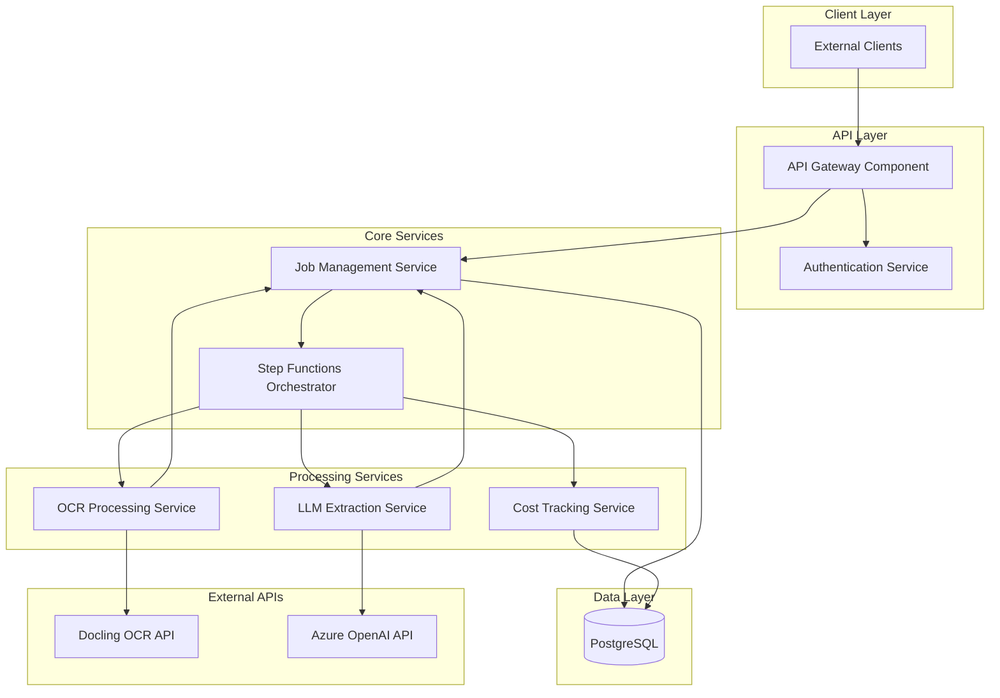

# Components

## API Gateway Component

**Responsibility:** Request routing, authentication, rate limiting, and CORS handling for all external client interactions.

**Key Interfaces:**
- POST /jobs - Accept new invoice processing requests
- GET /jobs/{id}/status - Retrieve current job processing status
- GET /jobs/{id}/result - Fetch completed extraction results
- GET /jobs/{id}/cost - Provide detailed cost breakdown

**Dependencies:** Authentication Service, Job Management Service

**Technology Stack:** AWS API Gateway V2, Lambda authorizer functions, CloudWatch logging

## Job Management Service

**Responsibility:** Core job lifecycle management including creation, status tracking, and result storage with database transaction management.

**Key Interfaces:**
- createJob(pdfUrl: string, apiKey: string): Promise<Job>
- updateJobStatus(jobId: string, status: JobStatus): Promise<void>
- getJobStatus(jobId: string): Promise<JobStatus>
- getJobResult(jobId: string): Promise<JobResult>

**Dependencies:** Database (PostgreSQL), Step Functions orchestrator

**Technology Stack:** Lambda functions with Hono framework, Drizzle ORM for type-safe data access, optimized connection pooling

## Step Functions Orchestrator

**Responsibility:** Workflow orchestration managing the complete processing pipeline with error handling, retries, and state transitions.

**Key Interfaces:**
- startProcessingWorkflow(job: Job): Promise<ExecutionId>
- handleProcessingStep(state: ProcessingState): Promise<NextState>
- handleProcessingError(error: ProcessingError): Promise<RetryAction>

**Dependencies:** OCR Processing Service, LLM Extraction Service, Job Management Service

**Technology Stack:** AWS Step Functions Express Workflows, CloudWatch monitoring, JSON state definitions

## OCR Processing Service

**Responsibility:** PDF document processing through Docling API integration with timeout handling, retry logic, and quality validation.

**Key Interfaces:**
- processDocument(pdfUrl: string): Promise<OCRResult>
- validatePDFUrl(url: string): Promise<ValidationResult>
- handleOCRTimeout(): Promise<RetryStrategy>

**Dependencies:** Docling OCR API, Job Management Service (status updates)

**Technology Stack:** Lambda functions with Hono framework, native fetch HTTP client, Step Functions retry handling, native logging

## LLM Extraction Service

**Responsibility:** Intelligent data extraction from OCR text using Azure OpenAI GPT-4 with structured output parsing and cost tracking.

**Key Interfaces:**
- extractInvoiceData(ocrText: string, schema: InvoiceSchema): Promise<ExtractionResult>
- validateExtractedData(data: InvoiceData): Promise<ValidationResult>
- trackProcessingCosts(tokens: TokenUsage): Promise<CostAttribution>

**Dependencies:** Azure OpenAI API, Job Management Service, Cost Tracking Service

**Technology Stack:** Lambda functions with Hono framework, native fetch with OpenAI API, structured prompt templates, token counting

## Authentication Service

**Responsibility:** API key management, validation, and usage tracking with rate limiting enforcement.

**Key Interfaces:**
- validateApiKey(keyHash: string): Promise<ApiKeyValidation>
- trackUsage(apiKeyId: string): Promise<UsageUpdate>
- enforceRateLimit(apiKeyId: string): Promise<RateLimitResult>

**Dependencies:** Database (ApiKey model), API Gateway throttling

**Technology Stack:** Lambda authorizer, bcrypt for hashing, API Gateway throttling

## Cost Tracking Service

**Responsibility:** Comprehensive cost attribution for all processing operations with real-time tracking and reporting.

**Key Interfaces:**
- recordProcessingCost(jobId: string, cost: ProcessingCost): Promise<void>
- calculateJobCost(jobId: string): Promise<TotalCost>
- generateCostReport(timeframe: TimeRange): Promise<CostReport>

**Dependencies:** Database (ProcessingEvent model), External service pricing APIs

**Technology Stack:** Lambda functions with Hono framework, scheduled cost calculations, native fetch for pricing APIs

## Component Diagrams

