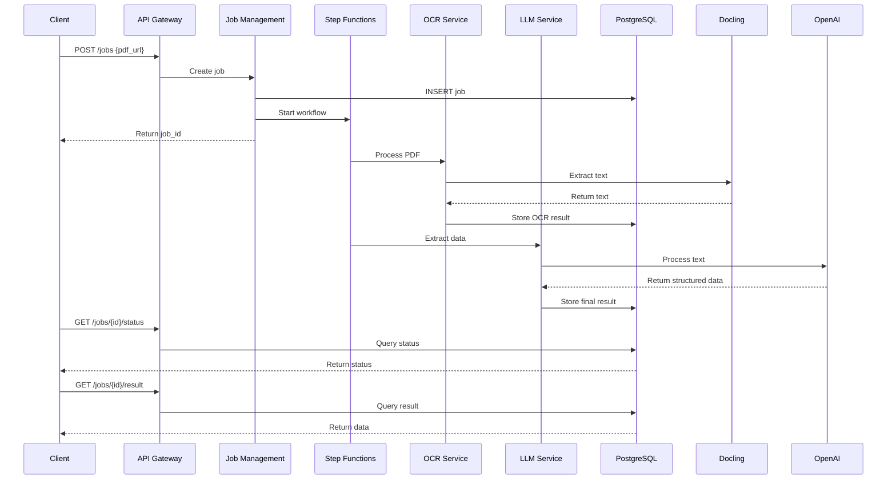

# Core Workflows

## Simplified Invoice Processing Workflow

```mermaid
sequenceDiagram
    participant Client
    participant API as API Gateway
    participant JobMgmt as Job Management
    participant SF as Step Functions
    participant OCR as OCR Service
    participant LLM as LLM Service
    participant DB as PostgreSQL

    Client->>API: POST /jobs {pdf_url}
    API->>JobMgmt: Create job
    JobMgmt->>DB: INSERT job
    JobMgmt->>SF: Start workflow
    JobMgmt-->>Client: Return job_id

    SF->>OCR: Process PDF
    OCR->>Docling: Extract text
    Docling-->>OCR: Return text
    OCR->>DB: Store OCR result

    SF->>LLM: Extract data
    LLM->>OpenAI: Process text
    OpenAI-->>LLM: Return structured data
    LLM->>DB: Store final result

    Client->>API: GET /jobs/{id}/status
    API->>DB: Query status
    DB-->>Client: Return status

    Client->>API: GET /jobs/{id}/result
    API->>DB: Query result
    DB-->>Client: Return data
```
