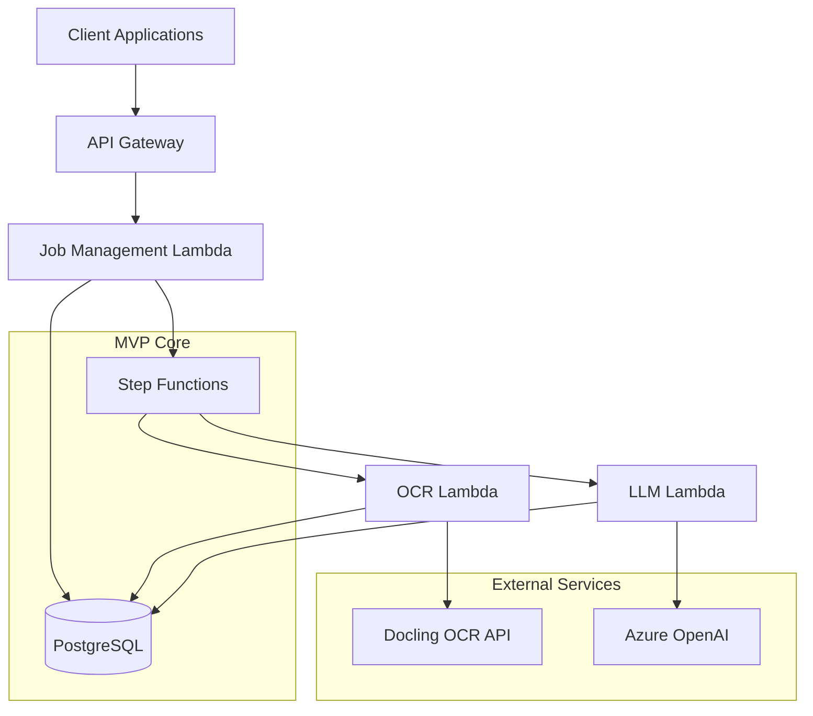

# High Level Architecture

## Technical Summary

CIRA employs a **simplified serverless architecture** using AWS Step Functions to orchestrate a basic 3-step workflow: PDF ingestion → OCR processing → LLM extraction. The system uses **PostgreSQL for all data storage** (no caching layer), with **basic error handling** and **simple cost tracking**. This minimal approach directly supports processing 10,000 invoices/month with 95% accuracy while keeping operational complexity to an absolute minimum.

## High Level Overview

**Architectural Style:** **Minimal Serverless** with Step Functions orchestration
- Three core Lambda functions: Job Management, OCR Processing, LLM Extraction
- Step Functions manages the 3-state workflow: OCR → Extract → Complete
- Single PostgreSQL database handles all data storage needs

**Repository Structure:** **Monorepo** (simplified)
- Basic structure: `api/`, `database/`, `infrastructure/` packages only
- Minimal shared utilities, focus on getting functional

**Service Architecture:** **Simple Microservices**
- API Gateway routes to Lambda functions
- Step Functions coordinates processing workflow
- Direct database access (no complex abstractions)

**Primary Data Flow:**
1. **Client Request** → API Gateway → Job Creation → Database
2. **Processing** → Step Functions → OCR → LLM → Database
3. **Results** → Database → Client

## High Level Project Diagram

## Architectural and Design Patterns

**1. Serverless-First Architecture**
- **Recommendation:** Pure AWS Lambda functions
- **Rationale:** Zero operational overhead, automatic scaling, pay-per-use aligns with MVP goals

**2. Simple State Machine Pattern**
- **Recommendation:** Basic Step Functions workflow with 3 states
- **Rationale:** Visual workflow monitoring without complex retry logic initially

**3. Direct Database Access Pattern**
- **Recommendation:** Simple database queries, no ORM initially
- **Rationale:** Fastest to implement, can optimize later when needed

**4. Basic REST API Pattern**
- **Recommendation:** 3 endpoints: POST /jobs, GET /jobs/{id}/status, GET /jobs/{id}/result
- **Rationale:** Minimal API surface area, easy to test and iterate
